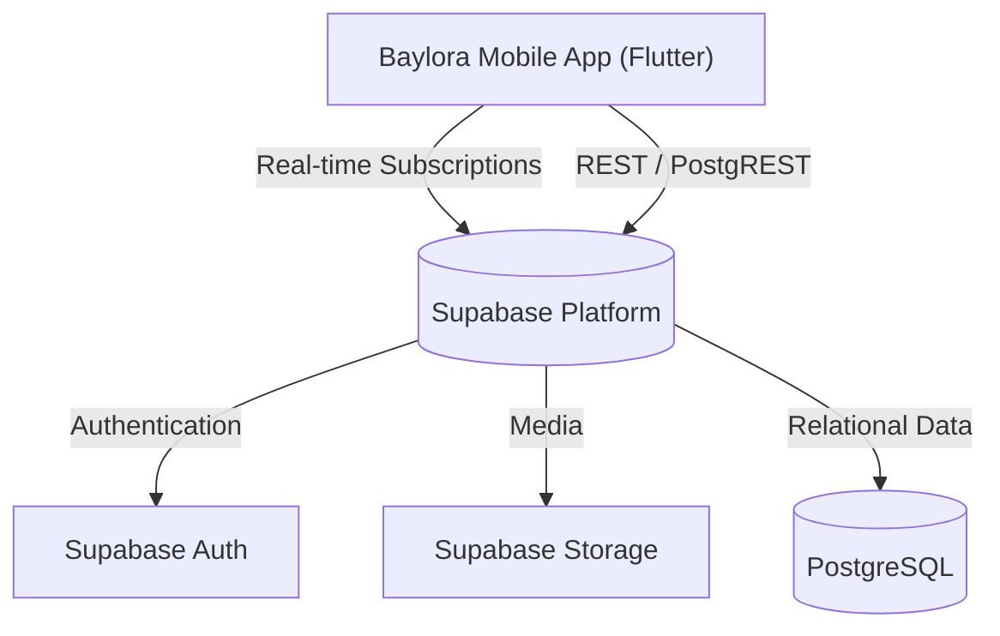

# System Architecture: Baylora

## 1. High-Level Architecture
Baylora is a mobile-first marketplace and trading platform designed for fast, real-time user bidding. It operates on a robust Backend-as-a-Service (BaaS) architecture using Supabase, which provides a seamless pipeline from the PostgreSQL database directly to the Flutter client without needing a middle-layer API server for CRUD operations.

## 2. Tech Stack & Trade-offs
*   **Frontend: Flutter (Dart)**
    *   *Trade-off:* Chosen over React Native for its highly customized rendering engine (Impeller/Skia) which ensures smooth, 60fps scrolling through heavy image grids (item listings). It compiles to native code for both iOS and Android from a single codebase.
*   **State Management: Riverpod**
    *   *Trade-off:* Riverpod is used over traditional Provider to guarantee compile-time safety when listening to complex state streams, such as live bidding updates or active user authentication status. It prevents common memory leaks associated with listening to real-time WebSockets.
*   **Backend: Supabase (PostgreSQL)**
    *   *Trade-off:* By bypassing a custom backend (like Node.js or Python) and going straight to Supabase, the app leverages Row Level Security (RLS) directly in the database. This drastically reduces development time for the MVP while ensuring that users can only modify their own active listings and bids.

## 3. State Management & Security
**Authentication & Media:**
User profiles are securely managed via **Supabase Auth**. Once authenticated, users interact with **Supabase Storage** to upload item images. The storage bucket is secured via RLS policies so that only authenticated users can upload media, but anyone can view the public URLs.

**Real-time Bidding (WebSockets):**
The `offers` table is the core of the marketplace. When a user submits an offer on a listing, Supabase's real-time PostgreSQL replication pushes that event immediately to the seller's device via WebSockets, allowing the UI to instantly display the new bid without requiring pull-to-refresh.

## 4. Core Business Logic: Multi-Type Transactions
The marketplace supports three complex transaction types: Cash, Trade, or Mixed. 
*   **Data Integrity:** The `items` table utilizes strict foreign key relationships (`profiles_id`) to link listings to verified sellers. 
*   **Offer Lifecycle:** The `offers` table tracks state transitions (`pending` -> `accepted` or `rejected`). When an offer is accepted, the item's `status` transitions from `active` to `sold`, automatically triggering a UI update for all users currently viewing that listing.

## 5. Deployment & CI/CD
The mobile client is packaged into native `.apk` and `.ipa` artifacts. The backend infrastructure is fully serverless, with Supabase handling horizontal scaling, database backups, and secure asset delivery over a global CDN.
