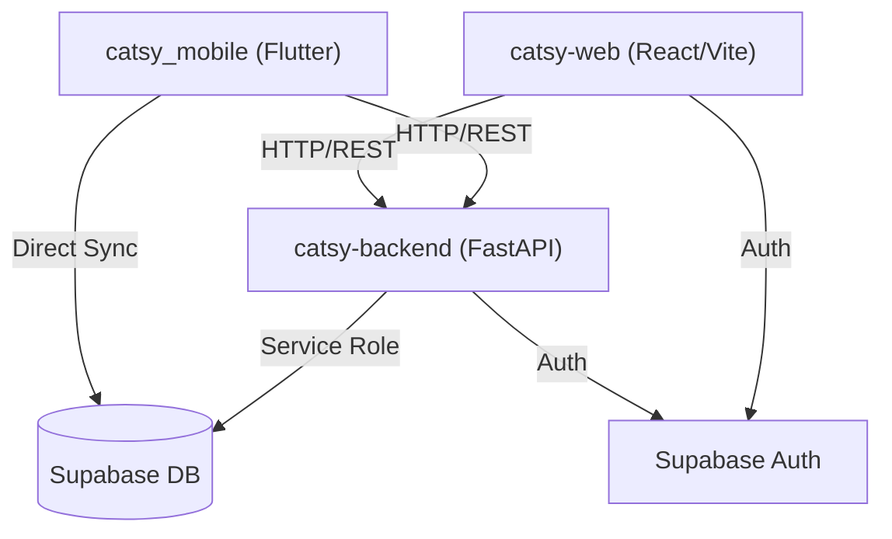

# System Architecture: Catsy Coffee

## 1. High-Level Architecture
Catsy Coffee operates on a robust, multi-client ecosystem. It features a React-based web storefront for customers, a Flutter-based mobile POS application for staff, and a centralized FastAPI backend. All clients interface with a shared Supabase instance for authentication and relational data storage.

## 2. System Architecture

## 3. Data Flow Diagram

## 4. Tech Stack & Trade-offs
*   **Backend: Python (FastAPI)**
    *   *Trade-off:* Chosen over Node/Express due to Python's strict type-hinting via Pydantic and rapid API generation (automatic Swagger docs). It natively handles complex asynchronous task queues (like SSE streaming for order updates) with `asyncio`.
*   **Web: React + Vite 7**
    *   *Trade-off:* React provides a massive component ecosystem, while Vite ensures instant Hot Module Replacement (HMR). Next.js was intentionally avoided to keep the storefront as an aggressively cached Single Page Application (SPA), lowering server rendering costs.
*   **Mobile: Flutter (Dart)**
    *   *Trade-off:* Allows a single codebase to compile to both iOS and Android natively. Used specifically for the staff POS to leverage native device features like hardware barcode scanning and push notifications.
*   **Database: Supabase (PostgreSQL)**
    *   *Trade-off:* Provides out-of-the-box Row Level Security (RLS), JWT-based authentication, and realtime webhooks. It acts as both the database and the auth provider, reducing architectural fragmentation.

## 5. State Management & Security
**Authentication Flow:**
Authentication is decoupled from the FastAPI backend. Both the web and mobile clients authenticate directly via **Supabase Auth** to receive a JWT. The backend API is secured using middleware that decodes and validates this JWT on every request, verifying the user's role (Customer vs. Staff) before allowing database mutations.

**Mobile Local State (Drift & Freezed):**
The Flutter POS app requires offline resilience. It uses `Drift` (a SQLite wrapper for Dart) to cache the menu and active tables locally. Complex state models are strongly typed and made immutable using `Freezed`.

## 6. Core Business Logic: Network Independence
The most complex architectural challenge was ensuring the Flutter POS app could seamlessly connect to the FastAPI backend dynamically, regardless of the network environment (Local Dev, Physical Phone on Wi-Fi, or Production).
*   **Dynamic API Bridging:** The app injects `--dart-define=API_BRIDGE_BASE_URL` at compile-time to allow developers to hot-swap between `localhost`, a physical `LAN IP`, or the production `Render` URL without changing hardcoded strings.
*   **Order Streaming:** The POS uses Server-Sent Events (SSE) from FastAPI to receive instant updates when a customer places an order via the React web app.

## 7. Deployment & CI/CD
The ecosystem is deployed across three distinct platforms:
1.  **Frontend (catsy-web):** Deployed to **Vercel** as a static build, optimizing edge-caching for customer assets.
2.  **Backend (catsy-backend):** Deployed to **Render** via a Blueprint `render.yaml` configuration, exposing the Python Uvicorn server on `$PORT`.
3.  **Database:** Managed securely via **Supabase cloud**, utilizing `public.device_tokens` for FCM push notifications across staff devices.
