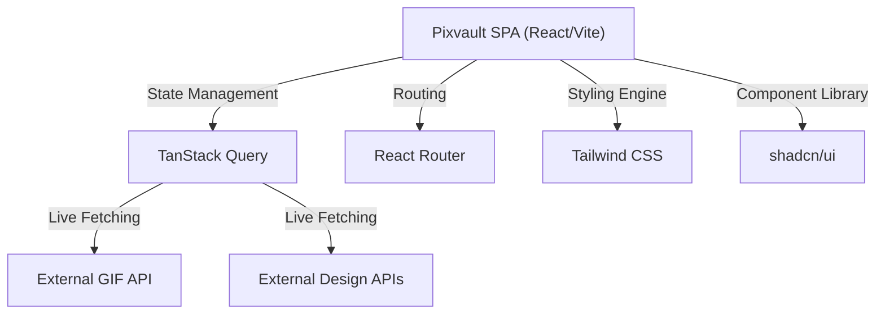

# System Architecture: Pixvault

## 1. High-Level Architecture
Pixvault is a high-performance Single Page Application (SPA) that aggregates and curates design resources (GIFs, icons, UI components). It is engineered to dynamically pull content from live external APIs while providing a lightning-fast, highly accessible frontend experience.

## 2. Tech Stack & Trade-offs
*   **Frontend: React 18 + Vite**
    *   *Trade-off:* Vite replaces Create React App (CRA) or Webpack to provide near-instant Hot Module Replacement (HMR). The application avoids SSR (Server-Side Rendering) frameworks like Next.js because its primary purpose is client-side API aggregation, allowing it to be hosted statically for free on CDNs.
*   **State Management: TanStack Query (React Query)**
    *   *Trade-off:* Standard React state (`useEffect` + `useState`) is inadequate for managing complex loading states, error handling, and caching of external API data. TanStack Query automatically handles background fetching, caching, and request deduplication.
*   **Styling: Tailwind CSS + shadcn/ui**
    *   *Trade-off:* Shadcn/ui provides highly accessible (WCAG compliant) Radix UI primitives that are directly copied into the source code rather than installed as an opaque npm package. This gives complete structural control while Tailwind handles rapid, utility-first styling.
*   **Animations: Framer Motion**
    *   *Trade-off:* Used for complex layout transitions and micro-interactions that CSS alone cannot handle gracefully (e.g., smoothly animating the masonry grid of GIFs or UI components).

## 3. Data Flow & Network Independence
Pixvault does not possess a traditional proprietary database. Instead, it acts as a highly optimized curation layer over existing live APIs.
*   **Caching Strategy:** TanStack Query caches API responses in memory. If a user navigates away from the "GIF Showcase" and returns, the UI renders instantly from the cache while a background re-fetch ensures the data is not stale.
*   **Pagination & Search:** The application handles dynamic search queries and infinite scrolling by manipulating URL parameters via React Router, keeping the UI state perfectly synced with the browser's history stack.

## 4. UI/UX Engineering
Because the application targets designers and developers, the UI architecture is heavily scrutinized for quality:
*   **Strict Typings:** Every UI component is strictly typed using TypeScript and validated using Zod, preventing runtime crashes from unpredictable external API payloads.
*   **Modular Organization:** The `src/components` directory is rigidly separated into `ui/` (dumb primitive components from shadcn) and Feature Components (`GifShowcase.tsx`, `HeroSection.tsx`), adhering to the Single Responsibility Principle.

## 5. Build & Deployment
Pixvault's architecture allows it to be compiled into a pure bundle of HTML, CSS, and JS (`index-[hash].js`). This output (`dist/`) is deployed to edge networks like Vercel or Cloudflare Pages, resulting in zero-server maintenance and sub-second Time To Interactive (TTI) metrics.
