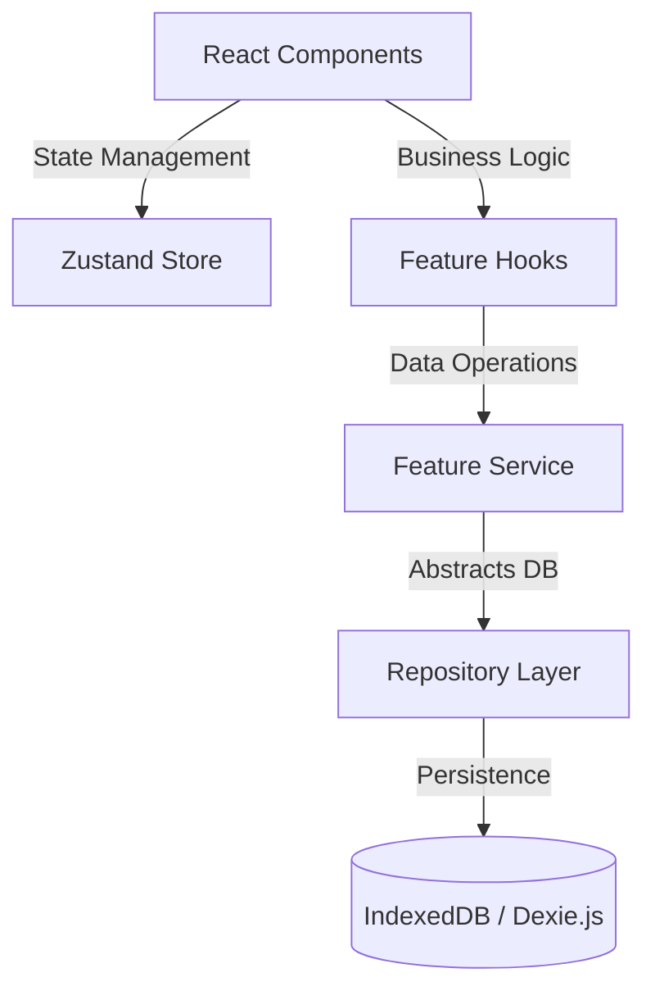

# System Architecture: ServeFlow POS

## 1. High-Level Architecture
ServeFlow POS is an aggressively offline-first, open-source Point of Sale ecosystem designed for cafés and restaurants. Unlike traditional POS systems that rely on constant server connectivity, ServeFlow runs entirely in the browser using a local-first repository pattern.

## 2. Tech Stack & Trade-offs
*   **React + Vite + TypeScript**
    *   *Trade-off:* Chosen over Next.js because Server-Side Rendering (SSR) is irrelevant for an offline-first POS application. Vite provides an exceptionally fast build process, and TypeScript ensures strict typings for critical business entities (like `Order`, `Payment`, and `InventoryMovement`).
*   **IndexedDB (Dexie.js)**
    *   *Trade-off:* Relational databases (like PostgreSQL) require a server. IndexedDB provides robust, asynchronous, local storage directly in the browser, allowing the restaurant to process sales, adjust inventory, and view menus without internet. Dexie.js wraps IndexedDB to provide a much simpler API.
*   **Zustand**
    *   *Trade-off:* Selected over Redux to avoid boilerplate. Zustand allows for fast, decoupled, global state management (e.g., active cart items, current cashier session) without slowing down rendering loops.
*   **vite-plugin-pwa**
    *   *Trade-off:* Allows the web app to be "installed" locally on Android tablets or Windows machines, bypassing the need for native wrappers (initially) while still providing a native app feel.

## 3. State Management & Security
Because ServeFlow is offline-first, the architecture heavily relies on the **Repository Pattern** and **Dependency Inversion** to manage state securely. React views NEVER call the database directly. 

*   **Data Integrity:** The system uses a strict flow: `UI -> Hook -> Service -> Repository -> Dexie`. This ensures that business logic (like checking if an item is out of stock) happens in the Service layer before it ever reaches the database.
*   **Sync Queue:** While the app operates completely offline, actions that modify data (like placing an order) push a serialized payload to a `sync_queue` table. When the internet is restored, a background worker processes this queue to sync with an external cloud provider (like Supabase).

## 4. Core Business Logic: Plugin Architecture
The system strictly adheres to the **Open/Closed Principle**. The core POS is deliberately kept simple: it handles products, categories, cart management, and receipts.

To prevent the core codebase from becoming bloated, advanced functionalities (like Loyalty Stamps, Mini-Games, or QR Ordering) are engineered as isolated **Plugins**. The core system exposes hookable events (e.g., `onOrderComplete`), which plugins can listen to without modifying the core POS logic. 

## 5. Deployment & Cross-Platform Scaling
The foundational build is a Progressive Web App (PWA) distributed via standard static hosting (e.g., Vercel/Netlify).

However, the repository pattern ensures that the storage engine can be swapped. The roadmap scales this architecture to multiple native platforms without rewriting business logic:
*   **Desktop:** Packaged via **Tauri** (swapping IndexedDB for a local SQLite file).
*   **Mobile:** Wrapped via **Capacitor** for Android/iOS native hardware access (e.g., thermal printers and barcode scanners).
*   **Cloud:** Synced via **Supabase** for multi-branch restaurant management.
